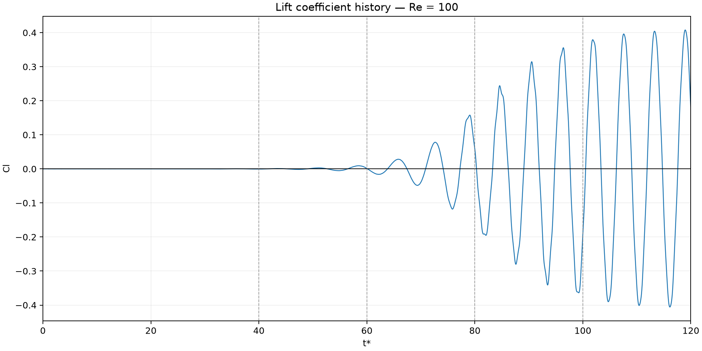

# Lattice Boltzmann Flow Past a Circular Cylinder

A two-dimensional computational engineering study of incompressible flow past a circular cylinder using a D2Q9 lattice Boltzmann method (LBM) with a single-relaxation-time BGK collision operator.

## What this study demonstrates

- D2Q9-BGK solver implemented in Python.
- Cylinder boundary treatment with half-way bounce-back.
- Zou/He velocity inlet and open outlet.
- Momentum-exchange force evaluation.
- Automated verification with pytest.
- A two-level grid-sensitivity exercise.
- A synchronized Reynolds-number wake comparison.

The study examines how the simulated wake changes across Reynolds numbers 25, 75, and 100. The animation uses one common normalized-vorticity scale and synchronized nondimensional time for all three cases.


The retained comparison checkpoints use:

| Parameter | Value |
|---|---:|
| Cylinder diameter, `D` | 20 lu |
| Domain, `nx × ny` | 600 × 200 |
| Free-stream velocity, `U_inf` | 0.0625 lu/ts |
| Final nondimensional time, `t*` | 120 |
| Reynolds numbers | 25, 75, 100 |

Here, `lu` denotes lattice units and `ts` denotes time steps. Nondimensional time and normalized spanwise vorticity are defined as

$$
t^* = \frac{t U_\infty}{D}
$$

$$
\omega_z^* = \frac{\omega_z D}{U_\infty}
$$

## Numerical method

The solver uses the standard D2Q9 velocity set and equilibrium distribution

$$
f_i^{eq} = w_i \rho
\left[
1
+ 3(\mathbf{e}_i \cdot \mathbf{u})
+ \frac{9}{2}(\mathbf{e}_i \cdot \mathbf{u})^2
- \frac{3}{2}(\mathbf{u} \cdot \mathbf{u})
\right]
$$

The BGK collision step is

$$
f_i^{post} = f_i
- \frac{1}{\tau}
\left(
f_i - f_i^{eq}
\right)
$$

with viscosity and relaxation time computed from the requested Reynolds number:

$$
\nu = \frac{U_\infty D}{Re}
$$

$$
\tau = 3\nu + \frac{1}{2}
$$

Boundary treatment and derived quantities:

- Half-way bounce-back at fluid–solid links on the cylinder.
- Zou/He velocity condition at the inlet.
- Open right boundary reconstructed from the adjacent interior column.
- Momentum exchange for cylinder force.
- In this two-dimensional model, the drag and lift coefficients per unit length are defined as

$$
C_D =
\frac{F_x}
{\frac{1}{2}\rho_\infty U_\infty^2 D}
$$

$$
C_L =
\frac{F_y}
{\frac{1}{2}\rho_\infty U_\infty^2 D}
$$

- Spanwise vorticity computed from the velocity gradients.
- Finite-value checks on particle distributions, density, and velocity throughout a run.

The simulation starts from a uniform stream with a small deterministic transverse perturbation to break exact centerline symmetry.

## Wake regimes

The retained visualization identifies the following qualitative behavior:

|  Re | Wake behavior                      |
| --: | ---------------------------------- |
|  25 | Steady symmetric wake              |
|  75 | Periodic vortex shedding           |
| 100 | Developed von Kármán vortex street |

These descriptions are qualitative classifications supported by the retained synchronized animation. No Strouhal number or shedding period is reported because neither quantity is currently documented as a verified result in the project.

## Lift history

The retained figure shows the temporal evolution of the lift coefficient `Cl` for the Re=100 case:



No additional lift extrema, mean drag coefficient, shedding frequency, or Strouhal number is quoted here because those values are not documented as validated summary results in the current project files.

## Grid sensitivity

The following values are transcribed directly from [`docs/grid_convergence.md`](docs/grid_convergence.md):

| D | Grid      | Re | U_inf | nu   | tau  | t* | Lr/D | Cd    | Cl  |
|--:|:----------|---:|------:|-----:|-----:|---:|-----:|------:|:----|
| 20 | 420 × 200 | 20 | 0.05  | 0.05 | 0.65 | 5  | 1.00 | 2.465 | ≈ 0 |
| 40 | 840 × 400 | 20 | 0.025 | 0.05 | 0.65 | 5  | 0.95 | 2.426 | ≈ 0 |

For these two documented levels, `Cd` changes by approximately 1.6%, while `Lr/D` changes from 1.00 to 0.95. This indicates relatively small sensitivity between the two resolutions tested, but it is not a complete grid-independence demonstration because only two resolution levels are available.

This grid-sensitivity exercise is a separate Re=20 configuration and should not be confused with the 600 × 200, Re=25/75/100 wake-comparison cases.

## Running a case

Create an environment and install the project dependencies:

```bash
python -m venv .venv
python -m pip install -r requirements.txt
```

Run a new case from the repository root:

```bash
python -m src.simulation --re 100 --t-star 20 --output data/example.npz
```

The command creates a compressed checkpoint containing the final particle distributions, force histories, drag and lift histories, sampled vorticity fields, timing information, and simulation parameters. Existing output files are not overwritten.

Checkpoint files are intentionally excluded by `.gitignore` because they are large generated artifacts.

## Tests

Run the unit tests with:

```bash
python -m pytest
```

The tests cover the D2Q9 weights, equilibrium recovery, BGK collision, streaming, bounce-back behavior, momentum-exchange force, inlet and outlet conditions, and macroscopic-variable recovery.

## Limitations

- The documented grid-sensitivity study contains only two resolution levels and therefore does not establish formal grid independence.
- The grid-sensitivity cases and the final Reynolds-number comparison use different documented configurations; their numerical values should not be combined as one validation series.
- No verified Strouhal number or vortex-shedding period is currently retained.
- No validated summary values for mean `Cd` or oscillatory `Cl` are currently documented for the Re=25/75/100 comparison.
- During development, Re=125, 150, 200, and 220 became numerically unstable with the present BGK formulation and discretization. These aborted cases are not considered physical results: execution was stopped when non-finite values appeared, and neither clipping nor artificial stabilization was used to conceal the divergence. This is an observation about the present implementation, resolution, and configuration—not a universal Reynolds-number limit for BGK. A TRT or MRT collision model would be a logical extension for improved robustness at lower viscosity and relaxation times closer to 0.5.
- The current study is two-dimensional and does not represent three-dimensional wake transitions.

## References

The numerical formulation and implementation choices in this study were guided primarily by the following references.

1. T. Krüger, H. Kusumaatmaja, A. Kuzmin, O. Shardt, G. Silva, and E. M. Viggen, *The Lattice Boltzmann Method: Principles and Practice*, Springer, 2017. DOI: [10.1007/978-3-319-44649-3](https://doi.org/10.1007/978-3-319-44649-3)
2. A. A. Mohamad, *Lattice Boltzmann Method: Fundamentals and Engineering Applications with Computer Codes*, Springer, 1st edition, 2011. DOI: [10.1007/978-0-85729-455-5](https://doi.org/10.1007/978-0-85729-455-5)

## Reproducibility note

New simulations can be run from a uniform initial state with the command-line interface shown above; no pre-existing checkpoint is required. Large `.npz` checkpoints are generated artifacts and are excluded from the public repository through `.gitignore`. Locally retained final checkpoints can be used to regenerate the comparison animation without rerunning the solver.
